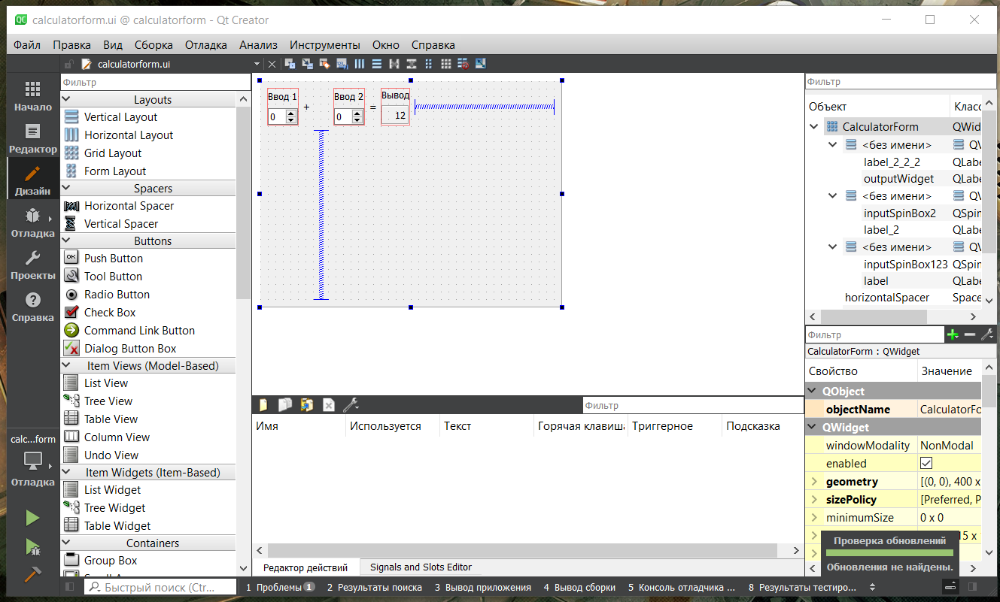
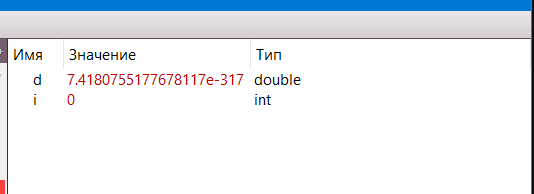
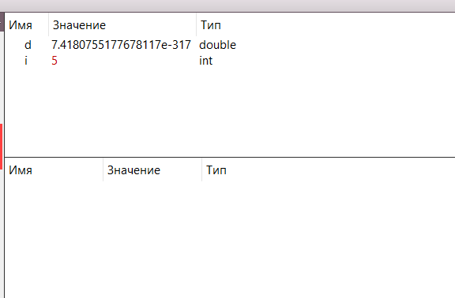
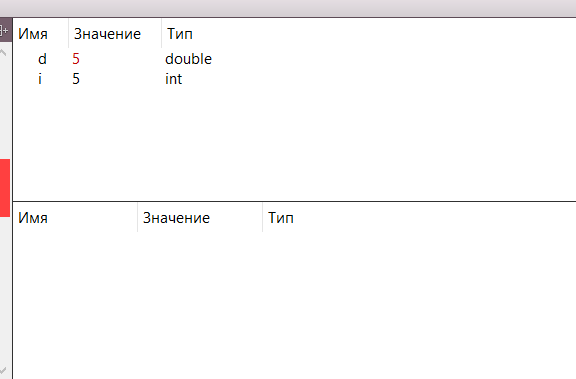

<p align="center">МИНИСТЕРСТВО НАУКИ  И ВЫСШЕГО ОБРАЗОВАНИЯ РОССИЙСКОЙ ФЕДЕРАЦИИ<br>
Федеральное государственное автономное образовательное учреждение высшего образования<br>
"КРЫМСКИЙ ФЕДЕРАЛЬНЫЙ УНИВЕРСИТЕТ им. В. И. ВЕРНАДСКОГО"<br>
ФИЗИКО-ТЕХНИЧЕСКИЙ ИНСТИТУТ<br>
Кафедра компьютерной инженерии и моделирования</p>
<br>

<h3 align="center">Отчёт по лабораторной работе № 4<br> по дисциплине "Программирование"</h3>

<br>

<br>

<p>студента 1 курса группы ПИ-б-о-202(2)<br>
Трофанчука Тимура Викторовича<br>
направления подготовки 09.03.04 "Программная инженерия"</p>

<br>

<br>

<table>
<tr><td>Научный руководитель<br> старший преподаватель кафедры<br> компьютерной инженерии и моделирования</td>
<td>(оценка)</td>
<td>Чабанов В.В.</td>
</tr>
</table>

<br>

<br>

<p align="center">Симферополь, 2020</p>
<hr>

## Постановка задачи

Настроить рабочее окружение, для разработки программного обеспечения при помощи Qt и IDE Qt Creator, а также изучить базовые возможности данного фреймворка.

## Цель работы

1. Установить фреймворк Qt;
2. Изучить основные возможности создания и отладки программ в IDE Qt Creator.

## Выполнение работы

### Задание 1.

Процесс установки: скачиваем QT с официального сайта, выбираем последнюю версию QT (в моём случае версия 6.0.1). Выбираем компоненты QT для сборки с помощью MinGW. Затем запускаем среду разработки Qt Creator и в разделе `Примеры` находим проект Calculator Form Example. Далее в каталоге `Формы` открываем главную форму проекта и заменяем текст "Input 1", "Input 2", "Output" на "Ввод 1", "Ввод 2" и "Вывод" соответственно.

<p align="center">
Рисунок 1. Скриншот замены текста.

### Задание 2.

1. Как изменить цветовую схему (оформление) среды?
В главном меню выбрать раздел "Инструменты", затем перейти в раздел "Параметры", далее в раздел "Среда" в пункт "Интерфейс".

2. Как закомментировать/раскомментировать блок кода средствами Qt Creator? Имеется ввиду комбинация клавиш или пункт меню.

Нужно выделить нуждый блок кода, а затем нажать сочетание славишь <em>Ctrl</em> + <em>/</em>.

3. Как открыть в проводнике Windows папку с проектом средствами Qt Creator?

В главном меню выбрать раздел "Файл", а затем пункт "Открыть файл или проект...". Либо с помощью сочетания клавишь <em>Ctrl</em> + <em>O</em>.

4. Какое расширение файла-проекта используется Qt Creator? Может быть несколько ответов.

Два расширения: <em>.pro</em> и <em>.user</em>

5. Как запустить код без отладки?

В главном меню выбрать раздел "Сборка", а затем "Запустить". Либо с помощью сочетания клавишь <em>Ctrl</em>+<em>R</em>. Либо слева снизу значок зелёный треугольник.

6. Как запустить код в режиме отладки?

С помощью клавиши <em>F5</em>

7. Как установить/убрать точку останова (breakpoint)?

Нужно нажать левой кнопкой мыши слева от номера нужной строки. Либо выбрать нужную строку и нажать клавишу <em>F9</em>.

### Задание 3.

Создаём консольное приложение без Qt. Заменяем содержимое файла main.cpp на:

```C++
#include <iostream>

int main() {
    int i;
    double d;
    i = 5;
    d = 5;
    std::cout << i << d;
}
```

В режиме откладки переменные i и d в 6-й строке равны:



Рисунок 2. Переменные i и d в 6-й строке.

В режиме откладки переменные i и d в 7-й строке равны:



Рисунок 3. Переменные i и d в 7-й строке.

В режиме откладки переменные i и d в 8-й строке равны:



Рисунок 4. Переменные i и d в 8-й строке.

### Вывод

В ходе лабораторной работы я научился
   - Устанавливать Qt
   - Работать с проектами
